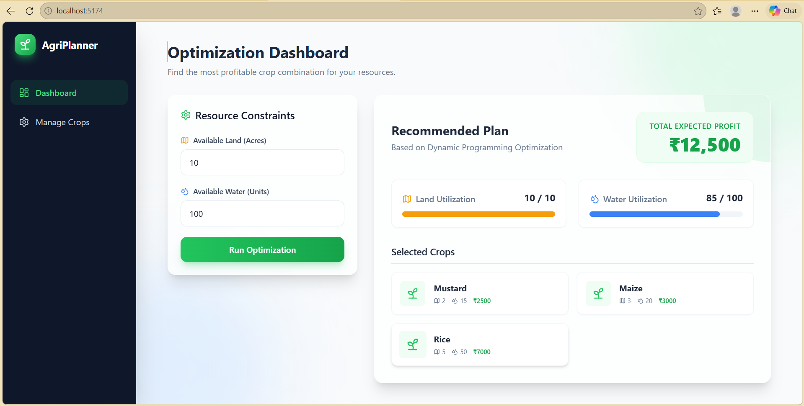
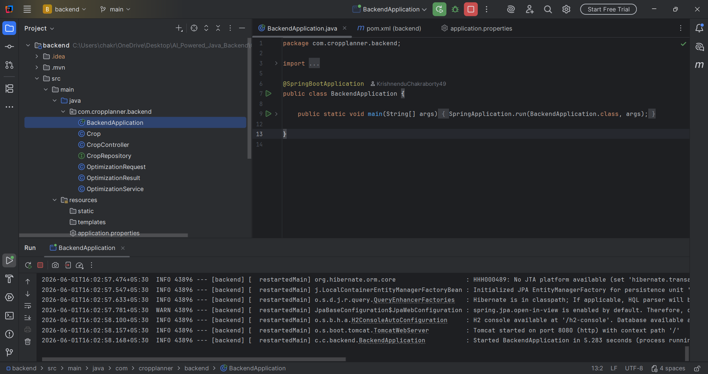

# Crop Planning Optimization System 🌱

A full-stack web application designed to help farmers identify the most profitable combination of crops based on limited land and water resources. 

This project was built to demonstrate proficiency in **Dynamic Programming**, **Agricultural Optimization Thinking**, **Clean Code Architecture**, and **Full-stack Development** using Spring Boot and React.

---

## 🎯 Objective
Farmers frequently face resource constraints. Given multiple crop options, each with distinct resource requirements (Land and Water) and expected profits, the objective is to determine the optimal crop combination that maximizes the total profit without exceeding the available resources.

## 🧠 Approach & Optimization Thinking

### 1. Crop-Related Optimization Thinking
In agricultural planning, resources are strictly finite. You cannot utilize more land or water than you possess. This creates a classic optimization scenario where decisions must be made holistically rather than greedily. For instance, picking the single highest-profit crop might consume all available water, preventing the planting of other smaller crops that, combined, would yield a higher total profit. 

By evaluating all possible valid combinations, this system ensures the farmer's resources are utilized with maximum financial efficiency.

### 2. Dynamic Programming Logic (Multi-Constraint Knapsack)
This problem is mathematically modeled as a **Multi-Constraint 0/1 Knapsack Problem**. 

Instead of a standard 2D knapsack (Items vs. 1 Capacity), we have two strict constraints: **Land** and **Water**. 
To solve this, a 3D Dynamic Programming array is utilized:

```text
DP[i][land][water]
```
Where:
- `i` = The number of crops considered so far.
- `land` = Remaining land capacity.
- `water` = Remaining water capacity.

**State Transition:**
For every crop, the algorithm evaluates two choices:
1. **Exclude the crop:** Profit remains the same as the previous state `dp[i-1][land][water]`.
2. **Include the crop:** If sufficient land and water are available, we add the crop's profit to the optimal profit of the remaining resources `profit[i] + dp[i-1][land - cropLand][water - cropWater]`.

The DP matrix evaluates the `max()` of these two choices, ensuring an absolute optimal solution. After building the DP table, the algorithm traces backward to identify exactly which crops were selected to achieve the maximum profit.

---

## 📸 Dashboard Preview



## 🖥️ Backend Server Running



---

## 💻 Technologies Used
- **Backend:** Java 17, Spring Boot, Spring Data JPA, REST APIs.
- **Database:** MySQL.
- **Frontend:** React.js, Vite, Tailwind CSS v3, Framer Motion (for UI micro-animations).

---

## ⚙️ Prerequisites
Ensure you have the following installed on your system:
1. **Java Development Kit (JDK) 17+**
2. **Node.js (v18+)**
3. **MySQL Server** running locally on port `3306`.

---

## 🚀 How to Run the Project

### 1. Database Setup
Ensure your local MySQL server is running. The backend is configured to automatically create the database if it doesn't exist.
- **Username:** `root`
- **Password:** `root`
*(If your MySQL credentials differ, update them in `backend/src/main/resources/application.properties` before running).*

### 2. Running the Backend (Spring Boot)
1. Open a terminal and navigate to the backend directory:
   ```bash
   cd backend
   ```
2. Run the application using the Maven wrapper:
   - **Windows:** `.\mvnw spring-boot:run`
   - **Mac/Linux:** `./mvnw spring-boot:run`
3. The backend API will start at `http://localhost:8080`.

### 3. Running the Frontend (React)
1. Open a new terminal and navigate to the frontend directory:
   ```bash
   cd frontend
   ```
2. Install the necessary dependencies:
   ```bash
   npm install
   ```
3. Start the Vite development server:
   ```bash
   npm run dev
   ```
4. Open your browser and navigate to the local URL provided (usually `http://localhost:5173/`).

---

## 🧪 Testing the Application
1. Go to the **Manage Crops** tab and add the following sample study area crops:
   - **Rice:** Land = 5, Water = 50, Profit = 7000
   - **Wheat:** Land = 4, Water = 40, Profit = 5000
   - **Maize:** Land = 3, Water = 20, Profit = 3000
   - **Mustard:** Land = 2, Water = 15, Profit = 2500
2. Go to the **Dashboard** tab.
3. Set Constraints: **Land = 10**, **Water = 100**.
4. Click **Run Optimization**. 
5. The system will recommend **Rice, Maize, and Mustard** for a mathematically proven maximum total profit of **₹12,500**.
